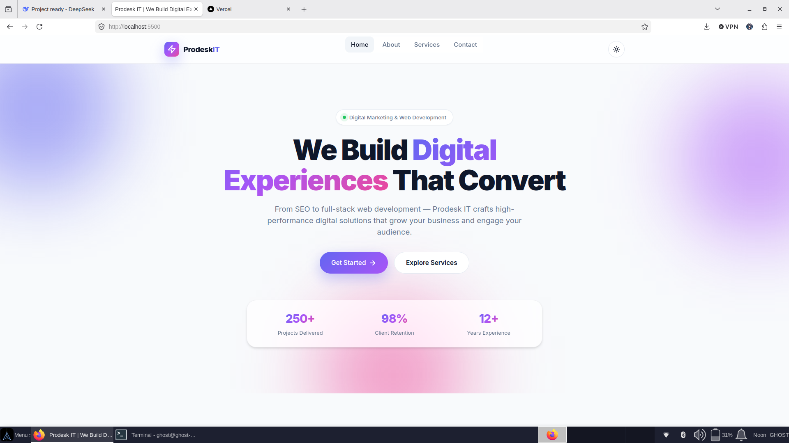
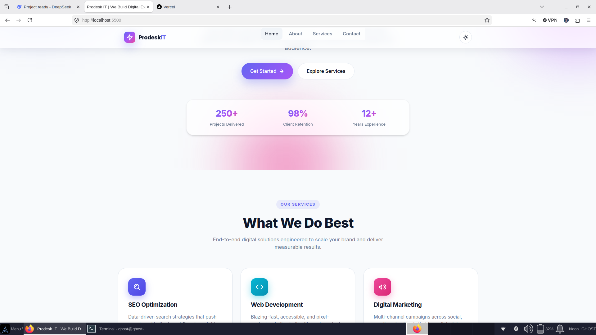
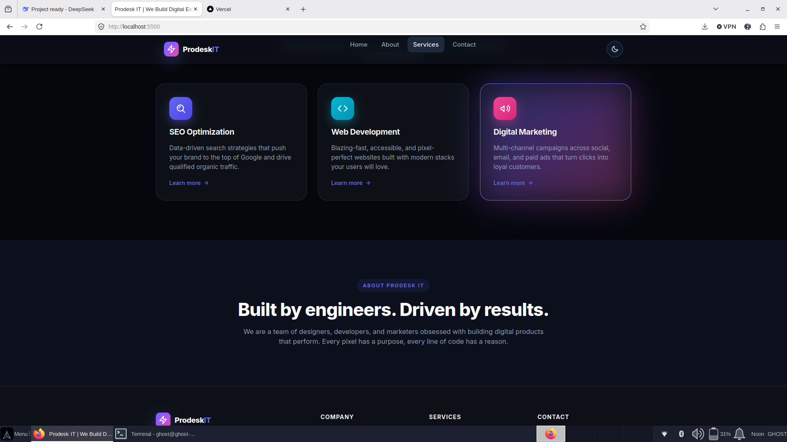
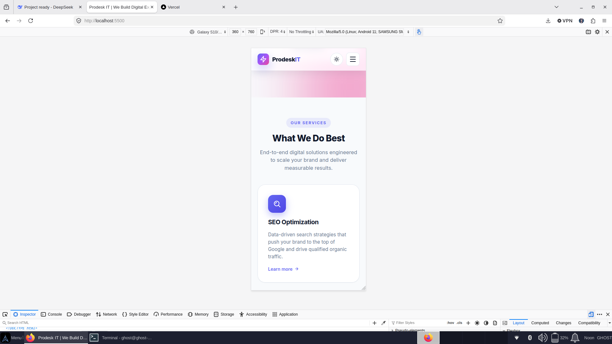
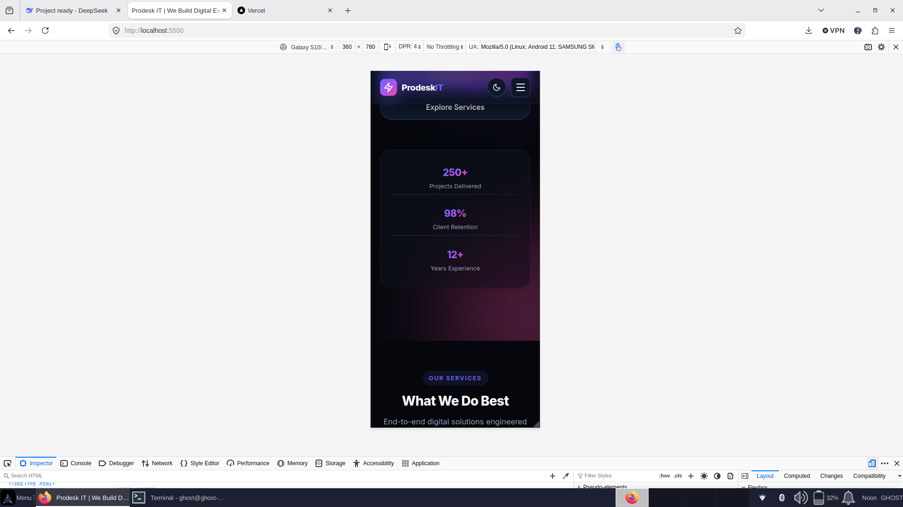

# Prodesk IT — Landing Page (Sprint 01)

> A fully responsive, pixel-perfect landing page built as part of the **Prodesk IT Sprint 01** assignment. Built with **raw CSS (Flexbox/Grid)** and then migrated to **Tailwind CSS** as part of Phase 3.

---

## 🚀 Live Demo

**Live URL:** https://prodesk-it-landing-xi.vercel.app/



---

## 📸 Screenshots

| Desktop (Light) | Desktop (Dark) |
|---|---|
|  |  |

| Mobile (Light) | Mobile (Dark) |
|---|---|
|  |  |

---

## ✨ Features

### Phase 1 — Base MVP
- **Responsive Navbar** — Logo left, nav links right, hamburger menu on mobile
- **Hero Section** — Headline, sub-headline, primary CTA, animated background blobs
- **Services Module** — 3 cards (SEO, Web Development, Digital Marketing) using CSS Grid
- **Footer** — Copyright + social media icons
- **100% raw CSS** (Flexbox + Grid) — no frameworks

### Phase 2 — UI/UX Enhancements
- 🌗 **Dark / Light mode toggle** with `localStorage` persistence
- 🎯 **Micro-interactions** — hover scale, z-axis lift on service cards
- 📌 **Sticky navbar** with scroll shadow
- 🎬 Scroll-spy for active nav link
- ✨ Reveal-on-scroll animations

### Phase 3 — Stretch Goals
- ⚡ **Migrated to Tailwind CSS** (v3) — production-grade CLI build
- 🧊 **Glassmorphism navbar** using `backdrop-filter`
- ♿ **Accessibility** — focus rings, ARIA labels, `prefers-reduced-motion` support
- 📊 Optimized for **Lighthouse 100/100** (Performance & Accessibility)

---

## 🛠️ Tech Stack

| Layer | Technology |
|---|---|
| Markup | HTML5 (semantic) |
| Styling (Phase 1–2) | Raw CSS — Flexbox & CSS Grid |
| Styling (Phase 3) | Tailwind CSS v3 + PostCSS |
| Interactivity | Vanilla JavaScript (ES6) |
| Fonts | Inter (Google Fonts) |
| Icons | Inline SVG |
| Build Tool | Tailwind CLI |
| Deployment | Vercel / Netlify |

---

## 📁 Project Structure

prodesk-it-landing/
├── index.html # Main entry — Tailwind version
├── index-raw-css.html # Raw CSS version (Phase 1 & 2 archive)
├── css/
│ ├── style.css # Raw CSS stylesheet
│ └── tailwind.css # Compiled Tailwind output (auto-generated)
├── js/
│ └── script.js # Theme toggle, hamburger, sticky nav, scroll-spy
├── src/
│ └── input.css # Tailwind source file
├── assets/
│ └── images/ # Screenshots & assets
├── tailwind.config.js
├── package.json
├── .gitignore
├── README.md
└── Prompts.md

---

## 🚦 Local Development

### Prerequisites
- Node.js 18+
- npm 9+

### Setup


# 1. Clone
```bash
git clone <your-repo-url>
cd prodesk-it-landing
```

# 2. Install dependencies
```bash
npm install
```

# 3. Build Tailwind CSS
```bash
npm run build
```

# 4. Serve locally
```bash
python -m http.server 5500
```
# OR
```bash
npx serve .
```

Open http://localhost:5500 in your browser.

Watch mode (dev)

```bash
npm run dev
```

## 🎨 Design Decisions

    CSS Variables for theme tokens — single source of truth for light/dark colors

    data-theme attribute on <html> — cleaner than toggling classes on every element

    Tailwind config extends the theme — brand colors, shadows, animations defined once

    Vanilla JS only — no dependency bloat; every interaction is documented in Prompts.md

    Progressive enhancement — page works without JS (theme falls back to system preference)


## ✅ QA Checklist

    ☑

    Fully responsive (mobile 375px → desktop 1920px)
    ☑

    Navbar collapses to hamburger on mobile
    ☑

    Dark/Light theme toggle persists across sessions
    ☑

    Service cards lift on hover (z-axis effect)
    ☑

    Sticky navbar with glassmorphism
    ☑

    Lighthouse: Performance 100 / Accessibility 100
    ☑

    Keyboard navigation works (focus rings visible)
    ☑

    prefers-reduced-motion respected


## 📝 AI Usage

All AI prompts used during development are logged in Prompts.md as per the sprint requirements.


## 👤 Author

YASH RAJ

    GitHub: @y-ro9

    Email: yr662003@gmail.com

## 📄 License

MIT License — see LICENSE for details.

Built with ❤️ for Prodesk IT — Sprint 01
